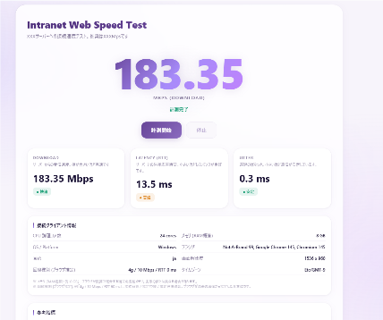
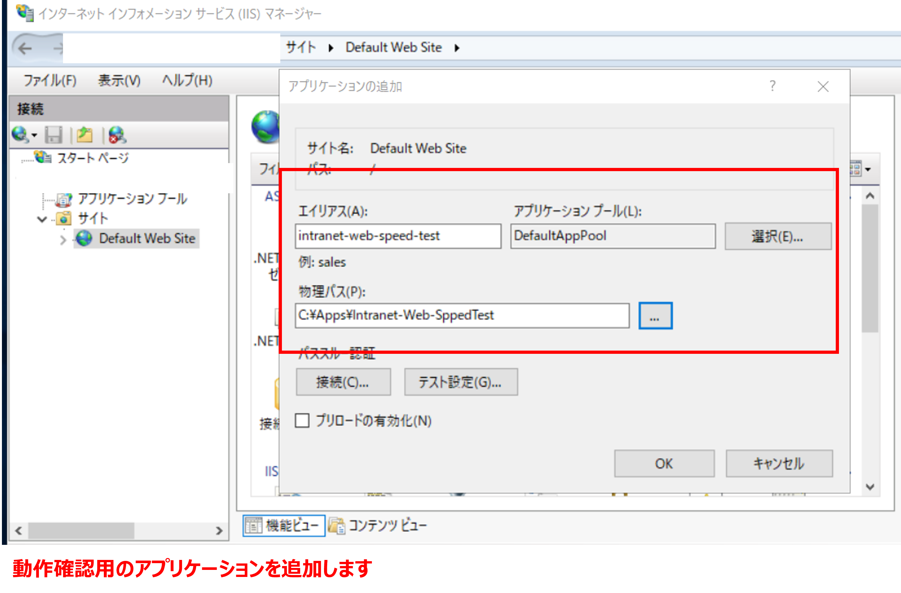
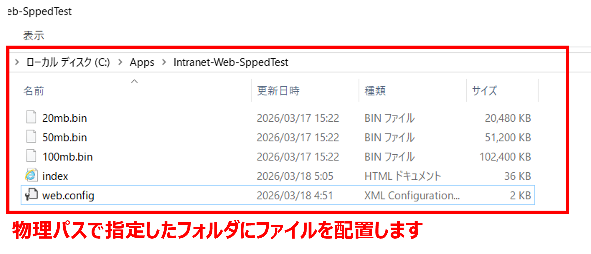

# Intranet Web Speed Test

主にIIS用途。社内ネットワーク（イントラネット）向けの Web ベース速度測定ツールです。ブラウザからサーバーへの **ダウンロード速度**・**レイテンシ (RTT)**・**ジッター** を計測できます。  
アプリが遅い！と言われたとき、いや、それネット速度だと思うけど。。なんて状況を説明するときに使います。  
インターネット上の速度テスト（例: [https://speedtest.example.com/](https://speedtest.gate02.ne.jp/)）で説明することもできますが、正確には社内サーバーとインターネット上のWEBサイトでは経路が異なるため、社内専用の速度測定が必要なケースで特に有効です。

## 動作イメージ
  
docs/00_video.mp4　に動画あり  

## 機能

- **ダウンロード速度測定** — 複数並列ストリームによる実効スループット計測（中央値ベース）
- **レイテンシ (RTT) 測定** — サーバーとの往復応答時間を複数回サンプリング
- **ジッター測定** — 遅延のばらつき（標準偏差）を算出
- **クライアント情報表示** — CPU コア数、メモリ、OS、ブラウザ、回線種別などを自動検出
- **参考指標 & tracert ガイド** — 計測結果の判断基準とネットワーク経路調査の手順を画面内に掲載

## 必要なもの

- IIS などの Web サーバー（`web.config` が含まれているため IIS 推奨）
- テスト用バイナリファイルを `index.html` と同じディレクトリに配置）
  - `100mb.bin`
  - `50mb.bin`
  - `20mb.bin`

## セットアップ

1. Web サーバーのドキュメントルート（または任意の仮想ディレクトリ）にファイルを配置します。

   ```
   /
   ├── index.html
   ├── web.config
   └── 100mb.bin   ← テスト用ファイル
   ```

## IIS でのセットアップ参考 (docs)

- アプリケーション追加（例）:
  
- テストファイル配置（例）:
  
2. ブラウザで `https://<サーバーアドレス>/` にアクセスし、**計測開始** ボタンを押してテストを実行します。

> ⚠️ 注意: IIS やリバースプロキシで HTTP 圧縮（gzip/deflate）や CDN 圧縮が有効な場合、ダウンロード速度の測定精度が大きく歪むことがあります。速度テストでは圧縮を無効にするか、テスト用の `.bin` ファイルに圧縮しない設定を使用してください。

## 計測の流れ

1. テスト用 `.bin` ファイルの存在を HEAD リクエストで確認
2. レイテンシを 6 回サンプリングし、平均 RTT とジッターを算出
3. 2 秒間のウォームアップ後、10 秒間のダウンロードテストを 4 並列ストリームで実施
4. 250 ms 間隔でスループットをサンプリングし、中央値を最終結果として表示

## 判定基準

| 指標 | 良好 | 普通 | 要注意 |
|------|------|------|--------|
| Download | 100 Mbps 以上 | 30 〜 100 Mbps | 30 Mbps 未満 |
| Latency (RTT) | 10 ms 以下 | 10 〜 50 ms | 50 ms 超 |
| Jitter | 5 ms 以下 | 5 〜 20 ms | 20 ms 超 |

## ライセンス

[MIT License](LICENSE)
